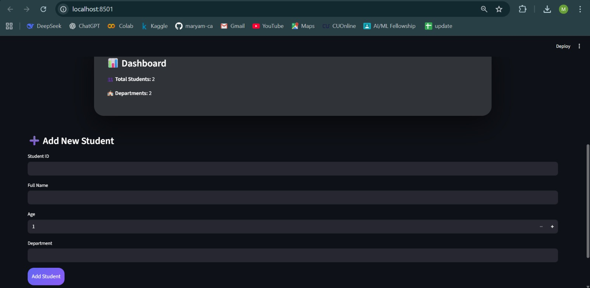
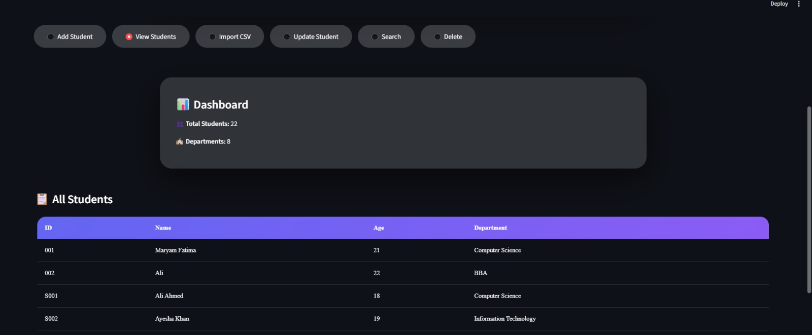
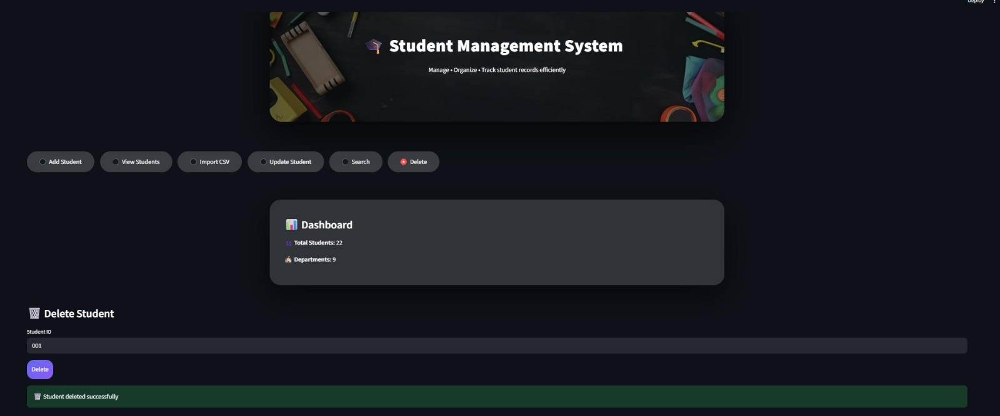

# 📘 Student Management System (Streamlit Mini App)

---

## 📌 Introduction

The **Student Management System** is a mini project developed as part of **Week 1 – Python Foundation**.  
This project demonstrates how **Python programming concepts** can be combined with a simple user interface using **Streamlit** to build a practical real-world application.

The application allows users to **add, view, and delete student records**, while ensuring that all data is stored safely using file-based storage.

This mini project focuses on clean code structure, basic Object-Oriented Programming, and beginner-friendly UI design.

---

## 🎯 Objectives of This Project

The main objectives of this project are:

- To understand how real-world problems can be solved using Python  
- To practice **Object-Oriented Programming (OOP)** concepts such as classes and objects  
- To learn **file handling** using JSON files  
- To implement **error handling** for better program reliability  
- To gain hands-on experience with **Streamlit** for building simple web apps  
- To follow proper **Git and GitHub project structure and documentation**

---

## 🚀 Features

This application provides the following features:

- Add new student records with unique IDs  
- View all stored student records in a clean layout  
- Delete students by providing their ID  
- Store data persistently using a JSON file  
- Handle errors such as duplicate IDs or missing records  
- Simple and user-friendly single-page Streamlit interface  

---

## 🧰 Technologies & Concepts Used

The following technologies and concepts are used in this project:

- Python programming language  
- Python functions and modular code  
- Object-Oriented Programming (Classes & Objects)  
- File handling using JSON  
- Error and exception handling  
- Streamlit for frontend UI  
- Git & GitHub for version control  

---

## 📁 Project Structure

The project follows a clean and modular folder structure:

mini_project/
├── src/
│ ├── app.py # Streamlit user interface
│ ├── student.py # Student class (OOP implementation)
│ └── storage.py # File handling and data logic
├── data/
│ └── students.json # Stored student records
├── requirements.txt # Project dependencies
└── README.md # Project documentation

---

## ▶️ How to Run the Project

Follow the steps below to run this project on your local machine.

### 1️⃣ Clone the Repository
git clone <your-repository-link>

### 2️⃣ Navigate to the Project Directory
cd Task5/mini_project

### 3️⃣ Install Required Dependencies
pip install -r requirements.txt

### 4️⃣ Run the Streamlit Application
streamlit run src/app.py

Once the command runs successfully, the application will open in your browser.

---

## 🧪 How the Application Works

1. The user opens the Streamlit app in the browser.  
2. The user can add a new student by entering details such as ID and name.  
3. All student records are saved in a JSON file.  
4. The user can view the list of all students.  
5. The user can delete any student by entering the student ID.  
6. Proper error messages are shown for invalid actions.

---

## 📸 Screenshots

Below are placeholders for screenshots.  
You can add images by placing them in the project folder and updating the paths.

### 🖼️ Application Home Page

---

### 🖼️ Add Student Feature

---

### 🖼️ View Students List

---

### 🖼️ Delete Student Feature

---

> 📌 **Note:**  
> Create a folder named `screenshots` inside `mini_project` and place your images there.

Example:
mini_project/
├── screenshots/
│ ├── home_page.png
│ ├── add_student.png
│ ├── view_students.png
│ └── delete_student.png

---

## 🧠 Learning Outcomes

After completing this project, the following learning outcomes were achieved:

- Strong understanding of modular Python programming  
- Practical use of Object-Oriented Programming concepts  
- Experience with file handling and data persistence  
- Ability to build simple web apps using Streamlit  
- Improved skills in GitHub documentation and project structuring  

---

## 🔮 Future Improvements

This project can be enhanced further by:

- Adding student update/edit functionality  
- Implementing search and filter features  
- Using a database instead of JSON for storage  
- Adding authentication and role-based access  
- Improving UI design with advanced Streamlit components  

---

## ✍️ Author

**Maryam Fatima**  
Week 1 – Python & Git Fellowship  

---
